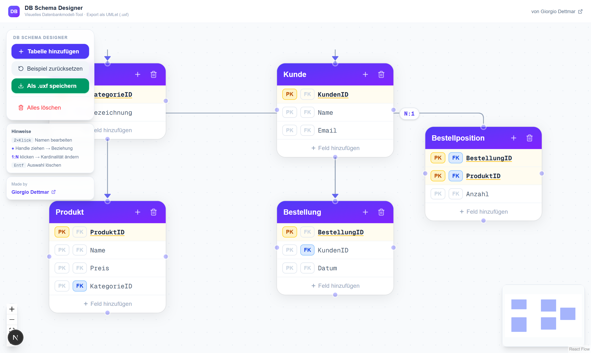

# DB Schema Designer

> I couldn't find a good free tool to visually create database schemas and export them — so I built one myself.

A lightweight, **interactive database schema designer** built with Next.js and React Flow.  
Design ER diagrams visually, set primary and foreign keys, define cardinalities (1:N, N:M, …), and export directly to **UMLet (.uxf)** format — all in the browser, no account required.



---

## ✨ Features

- **Interactive canvas** — drag & drop tables freely, zoom & pan
- **Create tables** — add tables with one click, name them inline
- **PK / FK toggles** — click `PK` or `FK` on any field to toggle markers
- **Cardinality on edges** — click the `1:N` label to cycle through `1:1 → 1:N → N:1 → N:M`
- **In-place editing** — double-click any table or field name to rename
- **UMLet export** — downloads a `.uxf` file ready to open in [UMLet](https://www.umlet.com/)
- **Example schema** — pre-loaded Webshop schema to get started immediately
- **Keyboard shortcuts** — `Delete` removes selected nodes/edges, `Shift` for multi-select

---

## 📸 Screenshot

<!-- To add a screenshot: open the app, press F12 → "Capture screenshot" in DevTools, save as public/screenshot.png -->

---

## 🚀 Getting Started

```bash
git clone https://github.com/Giorgiod91/db-schema-designer
cd db-schema-designer
npm install
npm run dev
```

Open [http://localhost:3000](http://localhost:3000).

---

## 📦 Deploy on Vercel

[](https://vercel.com/new/clone?repository-url=https://github.com/Giorgiod91/db-schema-designer)

Or:
1. Fork this repo
2. Go to [vercel.com](https://vercel.com) → **Import Project**
3. Select the repo — done, no extra config needed

---

## 🛠 Tech Stack

| | |
|---|---|
| [Next.js 16](https://nextjs.org/) | React framework with App Router |
| [@xyflow/react](https://reactflow.dev/) | Interactive node-based canvas |
| [Tailwind CSS](https://tailwindcss.com/) | Utility-first styling |
| [Lucide React](https://lucide.dev/) | Icon set |
| TypeScript | Full type safety throughout |

---

## 📐 UMLet Export Format

Tables are exported as `UMLClass` elements, relations as `Relation` elements — including cardinality labels (`m1`, `m2`).  
Open the `.uxf` file in [UMLet](https://www.umlet.com/) or the online editor at [umletino.com](https://www.umletino.com/).

---

## 👤 About the Author

Made by **Giorgio Dettmar**  
🌐 [giorgiodettmar.com](https://giorgiodettmar.com/)
